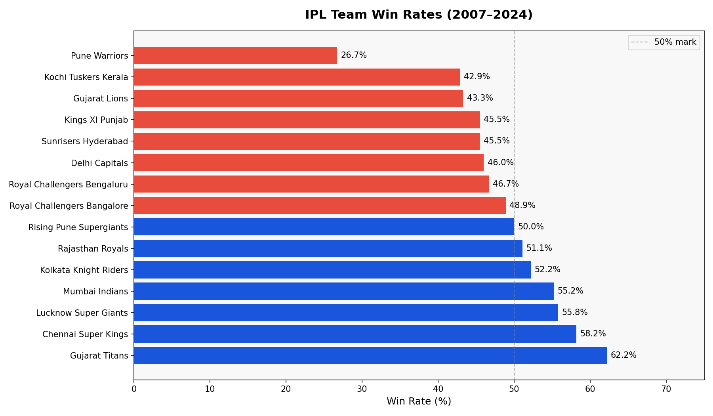
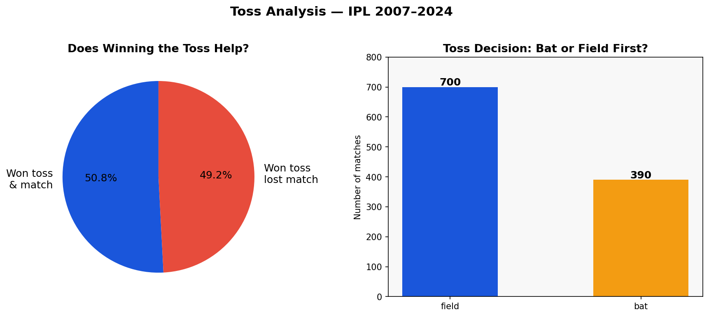
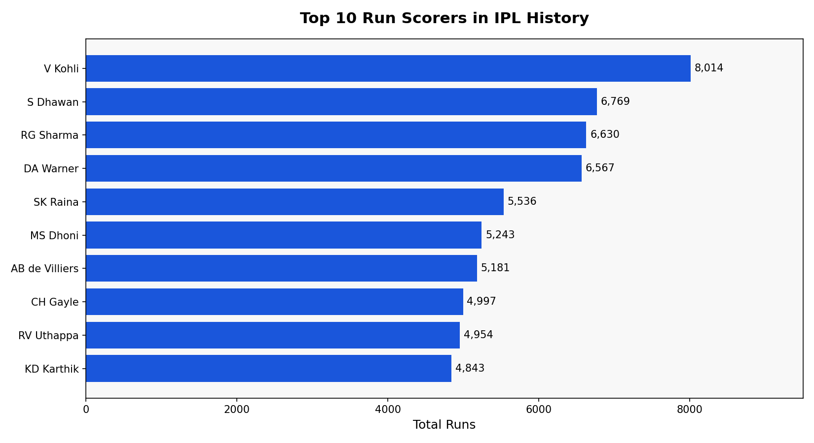
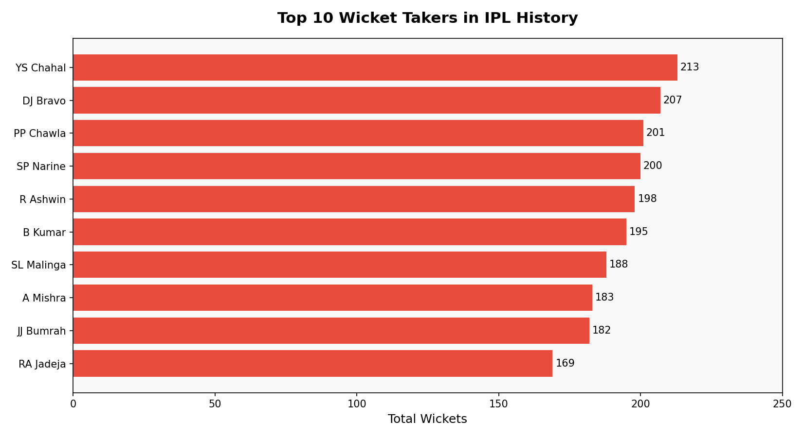
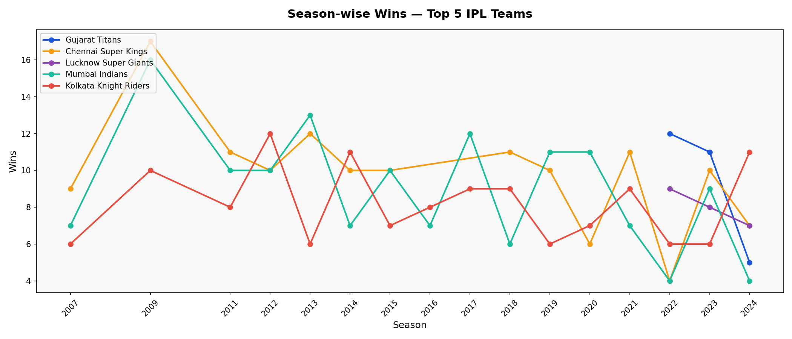

# 🏏 IPL Match Analyser (2007–2024)

Analysed 1,090 IPL match records and 260,920 ball-by-ball deliveries to uncover 
win-rate trends, toss impact, and top performer statistics using Python, Pandas, SQL and Matplotlib.

---

## 📊 Key Findings

- **Gujarat Titans** have the highest win rate at **62.2%** despite being the newest franchise
- Winning the toss has almost **no impact** — toss winners win only 50.8% of matches
- Teams prefer to **field first** 64% of the time after winning the toss
- **Virat Kohli** leads all-time run scorers with **8,014 runs**
- **Yuzvendra Chahal** leads wicket takers with **213 wickets**
- **Mumbai** is the most-used IPL venue with **173 matches hosted**

---

## 📈 Charts

### Win Rate by Team


### Toss Analysis


### Top 10 Batsmen


### Top 10 Bowlers


### Season-wise Wins (Top 5 Teams)


---

## 🛠 Tech Stack

| Tool | Purpose |
|------|---------|
| Python 3 | Core programming language |
| Pandas | Data loading, cleaning, analysis |
| SQLite / SQL | Querying win patterns by season and city |
| Matplotlib | Chart generation |
| Kaggle | Data source |

---

## 📁 Dataset

Source: [IPL Complete Dataset 2008–2024 on Kaggle](https://www.kaggle.com/datasets/patrickb1912/ipl-complete-dataset-20082020)

Download `matches.csv` and `deliveries.csv` and place them in the `data/` folder.

---

## 🚀 How to Run

```bash
git clone https://github.com/Ananya-s-14/ipl-match-analyser.git
cd ipl-match-analyser
pip install -r requirements.txt
python analysis.py
```

---

## 💡 SQL Queries Used

```sql
-- Wins per team per season
SELECT season, winner AS team, COUNT(*) AS wins
FROM matches
GROUP BY season, winner
ORDER BY season, wins DESC

-- Top cities by matches hosted
SELECT city, COUNT(*) AS matches_hosted
FROM matches
GROUP BY city
ORDER BY matches_hosted DESC
```